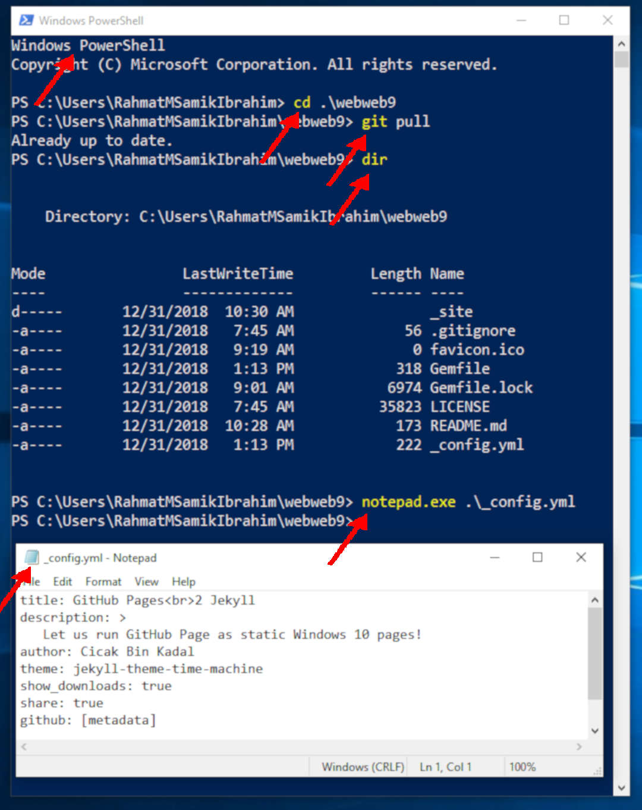
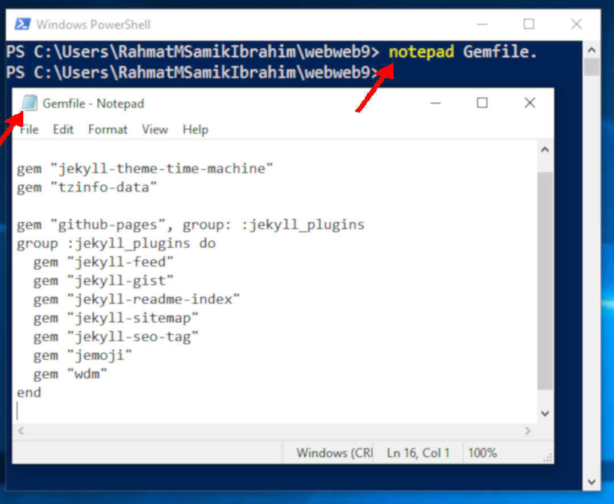
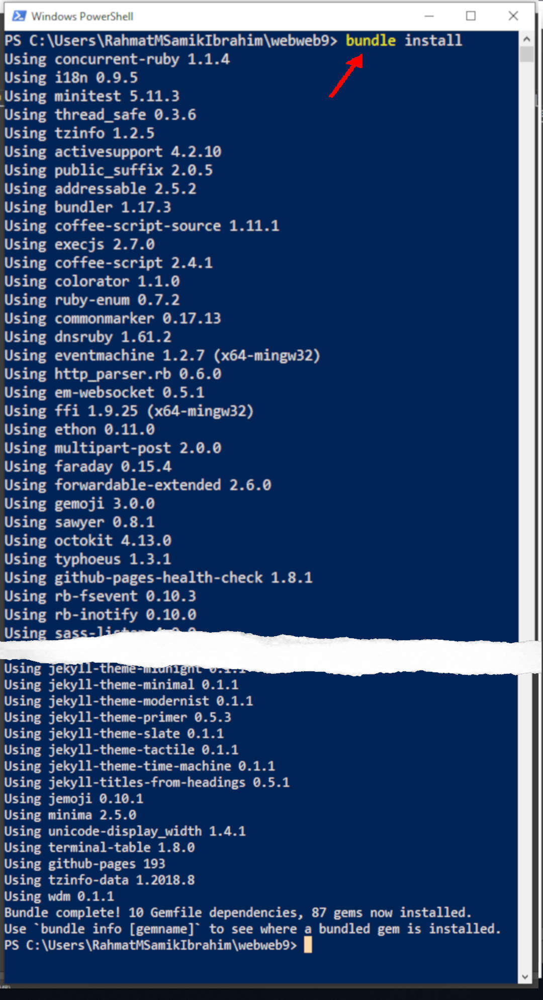
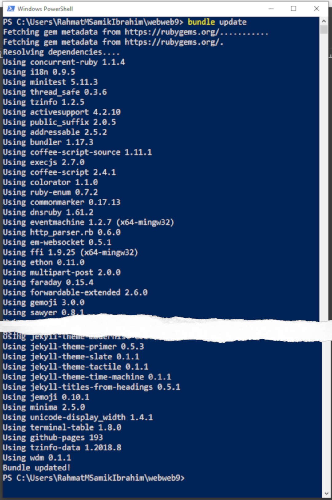
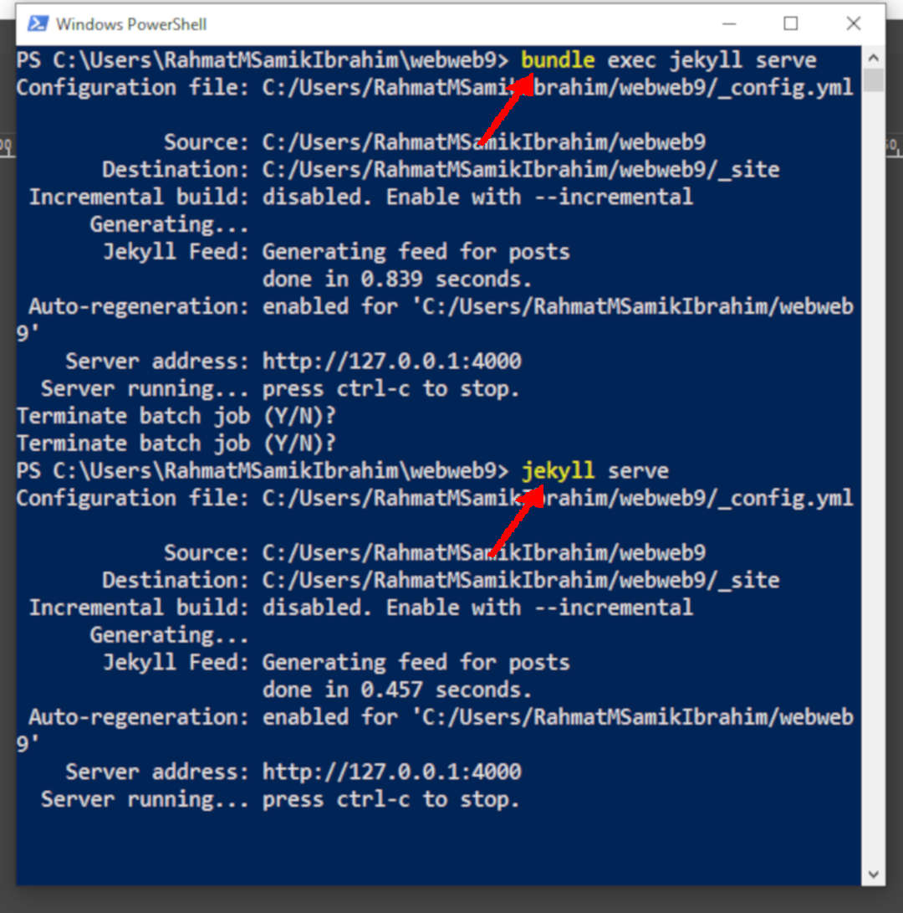
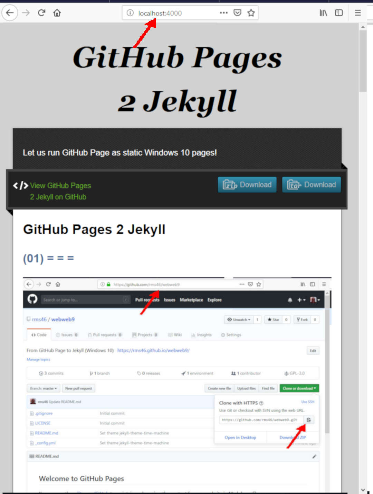

# GitHub Pages 2 Jekyll

## (01) = = =

## (02) = = =

## (05) = = =

## (06) = = =

## (07) = = =

## (08) = = =

## (09) = = =

## (10) = = =

## (10) = = =

## = = = = = = [NEXT: ](https://rms46.github.io/webweb6/) = = = = = =

